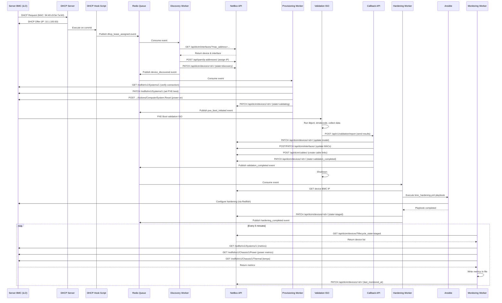

# Proof of Concept: Server Discovery to Monitoring Pipeline

**Goal**: Validate end-to-end automation from BMC power-on through discovery, validation, hardening, and monitoring for a single HPE Gen10 server.

**Status**: Planning Phase
**Target Duration**: 2-3 weeks
**Date**: 2026-02-11

---

## Overview

This PoC demonstrates the core automation workflow for baremetal server lifecycle management:

```
BMC Powers On → DHCP Request → NetBox Update → Discovery State →
ESB Trigger → BMC Connection → PXE Boot RHEL9 → LLDP Validation →
NetBox Interface Update → Ansible BMC Hardening → Staged State →
Redfish Monitoring
```

---

## Scope

### In Scope ✅
- DHCP hook script for MAC/IP capture
- NetBox API integration (lookup by MAC, update IP/state)
- ESB event processing (simplified with Python + Redis queue)
- HPE iLO Gen10 API integration (Redfish)
- PXE boot orchestration with custom RHEL9 ISO
- LLDP neighbor discovery and NetBox interface updates
- dmidecode hardware inventory collection
- Ansible playbook execution for BMC hardening
- Redfish polling for CPU/memory metrics
- State machine: `staged` → `discovery` → `validating` → `hardening` → `staged` → `monitored`

### Out of Scope ❌
- Full ESB infrastructure (Kafka) - use lightweight alternative
- Procurement and shipping workflows
- Firmware updates
- Multi-datacenter orchestration
- Tenant portal
- Full observability stack (just basic logging)
- Multiple server types (focus on HPE Gen10)

---

## Architecture (PoC Simplified)

```
┌─────────────────────────────────────────────────────────────────┐
│                     MaaS DHCP Server (ISC DHCP)                 │
│  ┌──────────────────────────────────────────────────────────┐   │
│  │  dhcpd.conf with exec hook                               │   │
│  │  on commit { execute("/opt/bm/dhcp_hook.sh", ...); }    │   │
│  └──────────────────────────────────────────────────────────┘   │
└────────────────────────────┬────────────────────────────────────┘
                             │ Calls
                             ↓
┌─────────────────────────────────────────────────────────────────┐
│              DHCP Hook Script (/opt/bm/dhcp_hook.sh)            │
│  - Collects: IP, MAC, hostname                                  │
│  - Publishes event to Redis queue                               │
└────────────────────────────┬────────────────────────────────────┘
                             │ Publishes to
                             ↓
┌─────────────────────────────────────────────────────────────────┐
│                    Redis Queue (Event Bus)                      │
│  Queue: bm:events:dhcp_lease                                    │
└────────────────────────────┬────────────────────────────────────┘
                             │ Consumed by
                             ↓
┌─────────────────────────────────────────────────────────────────┐
│           Discovery Service (Python Worker)                     │
│  ┌──────────────────────────────────────────────────────────┐   │
│  │  1. NetBox API: Find device by MAC                       │   │
│  │  2. NetBox API: Update IP address                        │   │
│  │  3. NetBox API: Transition state → "discovery"           │   │
│  │  4. Publish event: device_discovered                     │   │
│  └──────────────────────────────────────────────────────────┘   │
└────────────────────────────┬────────────────────────────────────┘
                             │ Publishes to
                             ↓
┌─────────────────────────────────────────────────────────────────┐
│                    Redis Queue: bm:events:device_discovered     │
└────────────────────────────┬────────────────────────────────────┘
                             │ Consumed by
                             ↓
┌─────────────────────────────────────────────────────────────────┐
│            Provisioning Service (Python Worker)                 │
│  ┌──────────────────────────────────────────────────────────┐   │
│  │  1. Connect to iLO via Redfish API                       │   │
│  │  2. Verify BMC connectivity                              │   │
│  │  3. Configure one-time PXE boot                          │   │
│  │  4. Trigger server power on/reset                        │   │
│  │  5. Update state → "validating"                          │   │
│  │  6. Publish event: pxe_boot_initiated                    │   │
│  └──────────────────────────────────────────────────────────┘   │
└────────────────────────────┬────────────────────────────────────┘
                             │ Triggers
                             ↓
┌─────────────────────────────────────────────────────────────────┐
│            Custom RHEL9 Validation ISO (PXE Booted)             │
│  ┌──────────────────────────────────────────────────────────┐   │
│  │  Validation Script (cloud-init/systemd service)          │   │
│  │  1. Run lldpctl to discover neighbors                    │   │
│  │  2. Parse interface names and MAC addresses              │   │
│  │  3. Run dmidecode for hardware model                     │   │
│  │  4. POST results to API endpoint (callback)              │   │
│  └──────────────────────────────────────────────────────────┘   │
└────────────────────────────┬────────────────────────────────────┘
                             │ Calls
                             ↓
┌─────────────────────────────────────────────────────────────────┐
│           Callback API Service (Flask/FastAPI)                  │
│  ┌──────────────────────────────────────────────────────────┐   │
│  │  Endpoint: POST /api/v1/validation/report               │   │
│  │  1. Receive validation data                              │   │
│  │  2. Update NetBox interfaces with LLDP data              │   │
│  │  3. Update NetBox device with hardware model             │   │
│  │  4. Publish event: validation_completed                  │   │
│  └──────────────────────────────────────────────────────────┘   │
└────────────────────────────┬────────────────────────────────────┘
                             │ Publishes to
                             ↓
┌─────────────────────────────────────────────────────────────────┐
│                Redis Queue: bm:events:validation_completed      │
└────────────────────────────┬────────────────────────────────────┘
                             │ Consumed by
                             ↓
┌─────────────────────────────────────────────────────────────────┐
│            Hardening Service (Python Worker)                    │
│  ┌──────────────────────────────────────────────────────────┐   │
│  │  1. Trigger Ansible playbook via AWX/Tower API           │   │
│  │     (or direct ansible-playbook execution)               │   │
│  │  2. Playbook: bmc_hardening.yml                          │   │
│  │     - Disable default accounts                           │   │
│  │     - Set strong BMC password                            │   │
│  │     - Configure SNMP v3 (disable v1/v2)                  │   │
│  │     - Disable unused services                            │   │
│  │     - Configure syslog forwarding                        │   │
│  │  3. Update state → "staged"                              │   │
│  │  4. Publish event: hardening_completed                   │   │
│  └──────────────────────────────────────────────────────────┘   │
└────────────────────────────┬────────────────────────────────────┘
                             │ Publishes to
                             ↓
┌─────────────────────────────────────────────────────────────────┐
│                Redis Queue: bm:events:hardening_completed       │
└────────────────────────────┬────────────────────────────────────┘
                             │ Consumed by
                             ↓
┌─────────────────────────────────────────────────────────────────┐
│            Monitoring Service (Python Worker)                   │
│  ┌──────────────────────────────────────────────────────────┐   │
│  │  Periodic Job (every 5 minutes via APScheduler)          │   │
│  │  1. Query NetBox for devices in "staged" state           │   │
│  │  2. For each device:                                     │   │
│  │     - Connect to iLO via Redfish API                     │   │
│  │     - GET /redfish/v1/Systems/1 (CPU, memory)            │   │
│  │     - GET /redfish/v1/Chassis/1/Power (power metrics)    │   │
│  │     - GET /redfish/v1/Chassis/1/Thermal (temps)          │   │
│  │  3. Store metrics (stdout/file for PoC)                  │   │
│  │  4. Update NetBox custom field: last_monitored_at        │   │
│  └──────────────────────────────────────────────────────────┘   │
└─────────────────────────────────────────────────────────────────┘
                             │ Metrics to
                             ↓
┌─────────────────────────────────────────────────────────────────┐
│              Metrics Output (JSON file for PoC)                 │
│  /var/log/bm/metrics/server-<uuid>-<timestamp>.json            │
└─────────────────────────────────────────────────────────────────┘


                    ┌────────────────────────┐
                    │   NetBox (SSOT)        │
                    │  - Device inventory    │
                    │  - Interface data      │
                    │  - State tracking      │
                    └────────────────────────┘
```

---

## Component Specifications

### 1. DHCP Hook Script

**Location**: `/opt/bm/dhcp_hook.sh`

**Trigger**: ISC DHCP `on commit` event

**Inputs** (from dhcpd environment variables):
- `$LEASED_IP` - Assigned IP address
- `$CLIENT_MAC` - Client MAC address
- `$CLIENT_HOSTNAME` - Hostname (if provided)

**Actions**:
1. Validate inputs (check for empty values)
2. Format event payload (JSON)
3. Publish to Redis queue `bm:events:dhcp_lease`
4. Log to syslog

**Event Schema**:
```json
{
  "event_type": "dhcp_lease_assigned",
  "timestamp": "2026-02-11T10:00:00Z",
  "source": "maas-dhcp-server",
  "data": {
    "ip": "10.1.100.50",
    "mac": "94:40:c9:5e:7a:b0",
    "hostname": "ilo-srv001",
    "lease_time": 86400
  }
}
```

**Dependencies**:
- `redis-cli` or `python3` with `redis` library
- `jq` for JSON formatting (optional)

---

### 2. Discovery Service (Python Worker)

**Location**: `/opt/bm/services/discovery_worker.py`

**Triggers**: Consumes from Redis queue `bm:events:dhcp_lease`

**Responsibilities**:
1. **NetBox Lookup by MAC**:
   - API: `GET /api/dcim/interfaces/?mac_address=<mac>`
   - Find device associated with interface
   - Verify device tenant is "baremetal staging"

2. **Update IP Address**:
   - API: `POST /api/ipam/ip-addresses/`
   - Assign IP to interface
   - Set status to "active"

3. **Update Device State**:
   - API: `PATCH /api/dcim/devices/<id>/`
   - Set custom field `lifecycle_state` = "discovery"
   - Set custom field `discovered_at` = current timestamp

4. **Publish Event**:
   - Queue: `bm:events:device_discovered`
   - Payload: device_id, device_name, ip, mac

**Error Handling**:
- If MAC not found in NetBox: log warning, do nothing (manual intervention)
- If multiple devices found: log error, do nothing
- If NetBox API fails: retry 3 times with exponential backoff

**Logging**: JSON structured logs to `/var/log/bm/discovery.log`

---

### 3. Provisioning Service (Python Worker)

**Location**: `/opt/bm/services/provisioning_worker.py`

**Triggers**: Consumes from Redis queue `bm:events:device_discovered`

**Responsibilities**:
1. **Retrieve BMC Credentials**:
   - From NetBox secrets or environment variable for PoC
   - Default: `Administrator` / `<from_env_or_vault>`

2. **Connect to iLO Redfish API**:
   - Base URL: `https://<ip>/redfish/v1/`
   - Verify connectivity: `GET /redfish/v1/Systems/1`
   - Check power state

3. **Configure One-Time PXE Boot**:
   - API: `PATCH /redfish/v1/Systems/1`
   - Set `Boot.BootSourceOverrideTarget` = "Pxe"
   - Set `Boot.BootSourceOverrideEnabled` = "Once"

4. **Power Control**:
   - If powered off: `POST /redfish/v1/Systems/1/Actions/ComputerSystem.Reset` with `ResetType: "On"`
   - If powered on: `ResetType: "ForceRestart"`

5. **Update NetBox State**:
   - Set `lifecycle_state` = "validating"
   - Set custom field `pxe_boot_initiated_at` = timestamp

6. **Publish Event**:
   - Queue: `bm:events:pxe_boot_initiated`

**Error Handling**:
- iLO connection timeout: retry 3 times, then fail and alert
- Authentication failure: log error, manual intervention needed
- PXE configuration failure: retry once, then fail

---

### 4. Custom RHEL9 Validation ISO

**Build Approach**: Use `livemedia-creator` or `mkksiso`

**Components**:
1. **Base**: RHEL 9 minimal ISO
2. **Additional Packages**:
   - `lldpd` (LLDP daemon)
   - `dmidecode` (hardware detection)
   - `curl` (API callback)
   - `jq` (JSON processing)

3. **Cloud-Init / Kickstart**:
   - Auto-login to root
   - Start validation service on boot

4. **Validation Script**: `/usr/local/bin/validate_server.sh`

**Script Logic**:
```bash
#!/bin/bash
# validate_server.sh

set -e

API_ENDPOINT="http://10.1.100.5:5000/api/v1/validation/report"
DEVICE_ID=$(cat /proc/cmdline | grep -oP 'device_id=\K[^ ]+')

# Wait for network
sleep 10

# Start LLDP daemon
systemctl start lldpd
sleep 5

# Collect LLDP neighbors
LLDP_DATA=$(lldpctl -f json)

# Collect hardware info
HARDWARE_MODEL=$(dmidecode -s system-product-name)
SERIAL_NUMBER=$(dmidecode -s system-serial-number)

# Collect interface info
INTERFACES=$(ip -j link show | jq '[.[] | select(.link_type == "ether") | {name: .ifname, mac: .address}]')

# Build payload
PAYLOAD=$(jq -n \
  --arg device_id "$DEVICE_ID" \
  --arg model "$HARDWARE_MODEL" \
  --arg serial "$SERIAL_NUMBER" \
  --argjson lldp "$LLDP_DATA" \
  --argjson interfaces "$INTERFACES" \
  '{
    device_id: $device_id,
    hardware: {
      model: $model,
      serial: $serial
    },
    lldp: $lldp,
    interfaces: $interfaces,
    timestamp: now | todate
  }')

# Send to callback API
curl -X POST "$API_ENDPOINT" \
  -H "Content-Type: application/json" \
  -d "$PAYLOAD"

# Shutdown after reporting
sleep 5
poweroff
```

**Boot Parameters** (passed via PXE/iPXE):
```
device_id=<netbox_device_uuid>
api_endpoint=http://10.1.100.5:5000/api/v1/validation/report
```

---

### 5. Callback API Service

**Location**: `/opt/bm/services/callback_api.py`

**Framework**: FastAPI (Python)

**Endpoint**: `POST /api/v1/validation/report`

**Request Body**:
```json
{
  "device_id": "uuid-1234",
  "hardware": {
    "model": "HPE ProLiant DL360 Gen10",
    "serial": "ABC123456"
  },
  "lldp": {
    "interface": [
      {
        "name": "eno1",
        "chassis": {
          "name": "switch-tor-01",
          "mgmt-ip": "10.1.1.1"
        },
        "port": {
          "id": "GigabitEthernet1/0/1"
        }
      }
    ]
  },
  "interfaces": [
    {"name": "eno1", "mac": "aa:bb:cc:dd:ee:01"},
    {"name": "eno2", "mac": "aa:bb:cc:dd:ee:02"}
  ],
  "timestamp": "2026-02-11T10:05:00Z"
}
```

**Actions**:
1. **Validate Device ID**: Check device exists in NetBox
2. **Update Hardware Model**:
   - API: `PATCH /api/dcim/devices/<id>/`
   - Set `device_type` if not set (may require device type creation)
   - Set custom field `serial_number`

3. **Update Interfaces**:
   - For each interface in payload:
     - API: `GET /api/dcim/interfaces/?device_id=<id>&name=<name>`
     - If exists: `PATCH /api/dcim/interfaces/<id>/` with MAC
     - If not exists: `POST /api/dcim/interfaces/` to create

4. **Parse LLDP and Update Switch Connections**:
   - For each LLDP neighbor:
     - Look up switch device in NetBox by name
     - Look up switch port by name
     - API: `POST /api/dcim/cables/` to create cable connection
     - Or update interface `connected_endpoints`

5. **Update State**:
   - Set `lifecycle_state` = "validation_completed"

6. **Publish Event**:
   - Queue: `bm:events:validation_completed`

**Response**:
```json
{
  "status": "success",
  "device_id": "uuid-1234",
  "message": "Validation data processed"
}
```

---

### 6. Hardening Service (Python Worker)

**Location**: `/opt/bm/services/hardening_worker.py`

**Triggers**: Consumes from Redis queue `bm:events:validation_completed`

**Responsibilities**:
1. **Retrieve Device Info**: Get BMC IP from NetBox
2. **Execute Ansible Playbook**:
   - Playbook: `/opt/bm/ansible/bmc_hardening.yml`
   - Inventory: Dynamic from NetBox or generated on-the-fly
   - Execution: `ansible-playbook` subprocess or AWX API call

3. **Ansible Playbook Tasks** (`bmc_hardening.yml`):
   ```yaml
   - name: Harden HPE iLO BMC
     hosts: "{{ target_device }}"
     gather_facts: no
     tasks:
       - name: Change default admin password
         hpe.ilo.ilo_user:
           baseuri: "{{ inventory_hostname }}"
           username: "{{ ilo_username }}"
           password: "{{ ilo_password }}"
           user_name: "Administrator"
           user_password: "{{ new_admin_password }}"

       - name: Disable unused user accounts
         hpe.ilo.ilo_user:
           baseuri: "{{ inventory_hostname }}"
           username: "{{ ilo_username }}"
           password: "{{ ilo_password }}"
           user_name: "{{ item }}"
           state: absent
         loop:
           - "user1"
           - "user2"

       - name: Configure SNMP v3
         hpe.ilo.ilo_snmp:
           baseuri: "{{ inventory_hostname }}"
           username: "{{ ilo_username }}"
           password: "{{ ilo_password }}"
           snmp_mode: "v3"
           snmp_v3_user: "{{ snmp_user }}"
           snmp_v3_auth_protocol: "SHA256"

       - name: Disable unused services
         hpe.ilo.ilo_service:
           baseuri: "{{ inventory_hostname }}"
           username: "{{ ilo_username }}"
           password: "{{ ilo_password }}"
           service_name: "{{ item }}"
           enabled: false
         loop:
           - "IPMI"
           - "Virtual Media"

       - name: Configure syslog forwarding
         hpe.ilo.ilo_syslog:
           baseuri: "{{ inventory_hostname }}"
           username: "{{ ilo_username }}"
           password: "{{ ilo_password }}"
           syslog_server: "10.1.100.10"
           syslog_port: 514
   ```

4. **Wait for Completion**: Poll Ansible job status
5. **Update NetBox State**:
   - Set `lifecycle_state` = "staged"
   - Set custom field `hardened_at` = timestamp

6. **Publish Event**:
   - Queue: `bm:events:hardening_completed`

**Error Handling**:
- Ansible playbook failure: log error, set state to "hardening_failed", alert

---

### 7. Monitoring Service (Python Worker)

**Location**: `/opt/bm/services/monitoring_worker.py`

**Trigger**: Periodic (APScheduler every 5 minutes)

**Responsibilities**:
1. **Query NetBox**:
   - API: `GET /api/dcim/devices/?tenant=baremetal-staging&custom_fields=lifecycle_state&lifecycle_state=staged`
   - Get list of staged devices

2. **For Each Device**:
   - Retrieve BMC IP
   - Connect to iLO Redfish API
   - Collect metrics:
     - `GET /redfish/v1/Systems/1`:
       - `ProcessorSummary.Count`
       - `ProcessorSummary.Status.Health`
       - `MemorySummary.TotalSystemMemoryGiB`
       - `MemorySummary.Status.Health`
     - `GET /redfish/v1/Chassis/1/Power`:
       - `PowerControl[0].PowerConsumedWatts`
       - `PowerSupplies[*].Status.Health`
     - `GET /redfish/v1/Chassis/1/Thermal`:
       - `Temperatures[*].ReadingCelsius`
       - `Fans[*].Reading` (RPM)

3. **Store Metrics**:
   - For PoC: JSON file per device per poll
   - File: `/var/log/bm/metrics/<device_id>-<timestamp>.json`
   - Format:
   ```json
   {
     "device_id": "uuid-1234",
     "device_name": "srv001",
     "timestamp": "2026-02-11T10:10:00Z",
     "metrics": {
       "cpu": {
         "count": 2,
         "health": "OK"
       },
       "memory": {
         "total_gb": 384,
         "health": "OK"
       },
       "power": {
         "consumed_watts": 250,
         "health": "OK"
       },
       "thermal": {
         "avg_temp_celsius": 32,
         "max_temp_celsius": 45,
         "health": "OK"
       }
     }
   }
   ```

4. **Update NetBox**:
   - Set custom field `last_monitored_at` = timestamp
   - Set custom field `last_power_watts` = power reading

**Future Enhancement**: Push to Prometheus Pushgateway or write to Prometheus textfile collector

---

## NetBox Schema Requirements

### Custom Fields Required

**For Device Model** (`dcim.device`):

| Field Name | Type | Description |
|------------|------|-------------|
| `lifecycle_state` | Selection | Current lifecycle state |
| `discovered_at` | Date & Time | When device was discovered |
| `pxe_boot_initiated_at` | Date & Time | When PXE boot was triggered |
| `hardened_at` | Date & Time | When BMC hardening completed |
| `last_monitored_at` | Date & Time | Last monitoring poll timestamp |
| `last_power_watts` | Integer | Last power consumption reading |

**lifecycle_state Choices**:
- `staged` (initial state)
- `discovery`
- `validating`
- `validation_completed`
- `hardening`
- `hardening_failed`
- `staged` (final state)
- `monitored`

### Required Device Setup

For the test server in NetBox:
1. **Device**: Create device entry
   - Name: `srv001` (or similar)
   - Device Type: HPE ProLiant (or generic if type unknown)
   - Site: Your datacenter site
   - Tenant: `baremetal-staging`
   - Status: `active`
   - Custom Field `lifecycle_state`: `staged`

2. **BMC Interface**: Create interface
   - Name: `ilo` or `bmc`
   - Type: `1000BASE-T`
   - MAC Address: `94:40:c9:5e:7a:b0` (actual BMC MAC)
   - Management Only: ✅
   - Enabled: ✅

3. **Data Interfaces** (placeholder, will be updated by validation):
   - Names: `eno1`, `eno2`, `eno3`, `eno4` (adjust based on server)
   - Type: `25GBASE-X SFP28` (if 25GbE)
   - Leave MAC addresses blank (will be populated)

---

## Event Flow Sequence



---

## Technology Stack (PoC)

| Component | Technology | Rationale |
|-----------|-----------|-----------|
| Event Bus | Redis (List/Pub-Sub) | Lightweight, easy to setup, sufficient for PoC |
| Worker Framework | Python + `rq` or custom loop | Simple, no heavy orchestration needed |
| API Framework | FastAPI | Fast, modern, auto-generates OpenAPI docs |
| DHCP Hook | Bash script | Native ISC DHCP integration |
| NetBox API Client | `pynetbox` | Official Python library |
| Redfish Client | `redfish` Python library | Standard library for Redfish API |
| Ansible | Ansible Core + `hpe.ilo` collection | Standard automation tool |
| Scheduler | APScheduler | Lightweight Python scheduler |
| Logging | Python `logging` module + JSON formatter | Structured logs for debugging |

---

## Implementation Steps

### Phase 1: Setup Infrastructure (Day 1-2)

1. **Install Redis**:
   ```bash
   sudo dnf install redis
   sudo systemctl enable --now redis
   ```

2. **Setup Python Environment**:
   ```bash
   sudo dnf install python3.11 python3-pip
   python3 -m venv /opt/bm/venv
   source /opt/bm/venv/bin/activate
   pip install pynetbox redfish fastapi uvicorn redis apscheduler
   ```

3. **Configure NetBox**:
   - Create custom fields for `dcim.device`
   - Create "baremetal-staging" tenant (if not exists)
   - Create test device with BMC interface

4. **Setup Directory Structure**:
   ```bash
   sudo mkdir -p /opt/bm/{services,scripts,ansible,logs,metrics}
   sudo mkdir -p /var/log/bm/metrics
   ```

### Phase 2: DHCP Hook (Day 2-3)

1. **Write DHCP Hook Script**: `/opt/bm/scripts/dhcp_hook.sh`
2. **Test Script**: Manually trigger with test data
3. **Configure ISC DHCP** (`/etc/dhcp/dhcpd.conf`):
   ```
   on commit {
     set clientIP = binary-to-ascii(10, 8, ".", leased-address);
     set clientMAC = binary-to-ascii(16, 8, ":", substring(hardware, 1, 6));
     execute("/opt/bm/scripts/dhcp_hook.sh", clientIP, clientMAC);
   }
   ```
4. **Restart DHCP**: `sudo systemctl restart dhcpd`
5. **Test**: Trigger BMC DHCP request, verify event in Redis

### Phase 3: Discovery Worker (Day 3-4)

1. **Write Discovery Worker**: `/opt/bm/services/discovery_worker.py`
2. **Test with Mock Event**: Publish test event to Redis, verify NetBox update
3. **Create systemd Service**: `/etc/systemd/system/bm-discovery.service`
4. **Start Service**: `sudo systemctl enable --now bm-discovery`

### Phase 4: Provisioning Worker (Day 4-5)

1. **Write Provisioning Worker**: `/opt/bm/services/provisioning_worker.py`
2. **Test iLO Connection**: Manually test Redfish API calls
3. **Test PXE Boot Configuration**: Verify one-time PXE boot works
4. **Create systemd Service**: `/etc/systemd/system/bm-provisioning.service`
5. **Start Service**: `sudo systemctl enable --now bm-provisioning`

### Phase 5: Validation ISO (Day 5-7)

1. **Write Validation Script**: `/usr/local/bin/validate_server.sh`
2. **Build Custom ISO**:
   ```bash
   # Use RHEL 9 as base
   # Add lldpd, dmidecode, curl, jq packages
   # Include validation script in /usr/local/bin/
   # Configure systemd service to run script on boot
   ```
3. **Configure PXE Server**:
   - Host ISO on HTTP server or mount as NFS
   - Update iPXE/PXE config
4. **Test Boot**: Manually boot test server from ISO, verify script runs

### Phase 6: Callback API (Day 7-8)

1. **Write Callback API**: `/opt/bm/services/callback_api.py`
2. **Test Endpoints**: Use `curl` to POST test validation data
3. **Verify NetBox Updates**: Check interfaces and cables created
4. **Create systemd Service**: `/etc/systemd/system/bm-callback-api.service`
5. **Start Service**: `sudo systemctl enable --now bm-callback-api`

### Phase 7: Hardening Worker (Day 8-10)

1. **Write Ansible Playbook**: `/opt/bm/ansible/bmc_hardening.yml`
2. **Install Ansible Collections**: `ansible-galaxy collection install hpe.ilo`
3. **Test Playbook**: Run manually against test iLO
4. **Write Hardening Worker**: `/opt/bm/services/hardening_worker.py`
5. **Test Integration**: Trigger validation_completed event, verify hardening runs
6. **Create systemd Service**: `/etc/systemd/system/bm-hardening.service`
7. **Start Service**: `sudo systemctl enable --now bm-hardening`

### Phase 8: Monitoring Service (Day 10-11)

1. **Write Monitoring Worker**: `/opt/bm/services/monitoring_worker.py`
2. **Test Redfish Metrics Collection**: Query test iLO for metrics
3. **Test Scheduling**: Verify APScheduler runs every 5 minutes
4. **Verify Metrics Files**: Check `/var/log/bm/metrics/` for output
5. **Create systemd Service**: `/etc/systemd/system/bm-monitoring.service`
6. **Start Service**: `sudo systemctl enable --now bm-monitoring`

### Phase 9: End-to-End Testing (Day 12-14)

1. **Reset Test Server**: Set NetBox state to `staged`, clear IP
2. **Power On BMC**: Trigger DHCP request
3. **Monitor Logs**: Tail all service logs
4. **Verify Each Stage**:
   - DHCP hook publishes event ✅
   - Discovery updates NetBox ✅
   - Provisioning triggers PXE boot ✅
   - Validation ISO boots and reports ✅
   - Callback API updates NetBox ✅
   - Hardening runs Ansible playbook ✅
   - Monitoring collects metrics ✅
5. **Document Issues**: Note any failures or improvements needed
6. **Iterate**: Fix issues and re-test

---

## Success Criteria

The PoC is considered successful when:

✅ **Automated Discovery**:
- BMC DHCP request automatically discovered
- NetBox updated with IP and state transition
- No manual intervention required

✅ **Automated Provisioning**:
- iLO configured for PXE boot via Redfish API
- Server boots validation ISO automatically

✅ **Automated Validation**:
- LLDP neighbors discovered
- NetBox interfaces updated with MAC addresses
- Switch port connections documented
- Hardware model captured

✅ **Automated Hardening**:
- Ansible playbook executes successfully
- BMC security settings applied
- No hardcoded passwords (use Vault or env vars)

✅ **Automated Monitoring**:
- Metrics collected every 5 minutes
- CPU, memory, power, temperature captured
- Data stored in structured format

✅ **Event-Driven Flow**:
- Each stage triggers the next via events
- No polling or manual triggers
- Complete audit trail in Redis/logs

✅ **Observability**:
- Logs available for each component
- Event history in Redis
- NetBox state reflects reality

---

## What We Learn from This PoC

### Validated Assumptions ✅
1. **DHCP Hook Approach**: Can we reliably capture BMC DHCP requests?
2. **NetBox as SSOT**: Does NetBox work well for state tracking?
3. **Event-Driven Pattern**: Is Redis sufficient for event bus? When do we need Kafka?
4. **Redfish API**: Are iLO APIs reliable and complete?
5. **PXE Automation**: Can we fully automate PXE boot and validation?
6. **Ansible Integration**: Does Ansible work well for BMC configuration?

### Identified Gaps 🔍
1. **Error Handling**: What failure modes occur? How to handle them?
2. **Performance**: How long does each stage take? Where are bottlenecks?
3. **Scale**: Will this approach work for 100+ servers? 1000+?
4. **Security**: Are credentials handled securely? Need Vault integration?
5. **Multi-Vendor**: Dell OpenManage differences vs HPE?

### Next Steps After PoC 🚀
1. **Add Kafka**: Replace Redis with Kafka for durability and scale
2. **Add Temporal**: Replace custom workers with Temporal workflows
3. **Add Prometheus**: Replace JSON files with Prometheus metrics
4. **Add Observability**: Add Jaeger tracing, structured logging to ELK
5. **Add Web UI**: Basic dashboard to view pipeline status
6. **Multi-Server Testing**: Run 5-10 servers through pipeline
7. **Dell Support**: Add Dell OpenManage integration
8. **Firmware Updates**: Add firmware update stage

---

## Files to Create

### Scripts
1. `/opt/bm/scripts/dhcp_hook.sh` - DHCP hook script
2. `/opt/bm/scripts/validate_server.sh` - Validation ISO script

### Services (Python)
3. `/opt/bm/services/discovery_worker.py`
4. `/opt/bm/services/provisioning_worker.py`
5. `/opt/bm/services/callback_api.py`
6. `/opt/bm/services/hardening_worker.py`
7. `/opt/bm/services/monitoring_worker.py`

### Ansible
8. `/opt/bm/ansible/bmc_hardening.yml` - Hardening playbook
9. `/opt/bm/ansible/inventory/netbox.yml` - Dynamic inventory (optional)

### Systemd Services
10. `/etc/systemd/system/bm-discovery.service`
11. `/etc/systemd/system/bm-provisioning.service`
12. `/etc/systemd/system/bm-callback-api.service`
13. `/etc/systemd/system/bm-hardening.service`
14. `/etc/systemd/system/bm-monitoring.service`

### Configuration
15. `/opt/bm/config.yml` - Central configuration file
16. `/etc/dhcp/dhcpd.conf` - DHCP server config (modify)

### Documentation
17. `/opt/bm/README.md` - PoC setup and operation guide
18. `/opt/bm/TESTING.md` - Testing procedures

---

## Estimated Timeline

**Total Duration**: 2-3 weeks (assuming 1 person, part-time)

- **Week 1**: Infrastructure setup, DHCP hook, discovery worker, provisioning worker
- **Week 2**: Validation ISO, callback API, hardening worker, monitoring service
- **Week 3**: End-to-end testing, documentation, iteration

**Accelerated**: Could be done in 1 week with 2-3 people working full-time

---

## Risk Mitigation

| Risk | Impact | Mitigation |
|------|--------|------------|
| iLO API rate limits | Provisioning delays | Add retry logic, respect rate limits |
| PXE boot failures | Validation never completes | Add timeout, fallback to manual, alert |
| NetBox API slowness | Discovery delays | Add caching, optimize queries |
| DHCP hook not firing | No discovery | Test DHCP config thoroughly, add monitoring |
| Ansible playbook failures | Hardening incomplete | Idempotent tasks, retry logic, error alerts |
| Validation ISO network issues | No callback | Add retry in ISO, timeout in callback API |

---

## Next Document

After reviewing this PoC plan, I can create:
1. **Detailed code for each component** (scripts, services, playbooks)
2. **Configuration files** (DHCP, systemd, YAML)
3. **Testing procedures** with example commands
4. **ISO build instructions** (livemedia-creator or kickstart)

**Ready to proceed?** Let me know which component to start with, or if you'd like me to create all the code at once.
